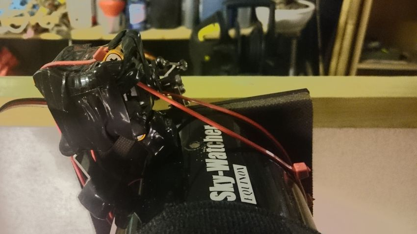
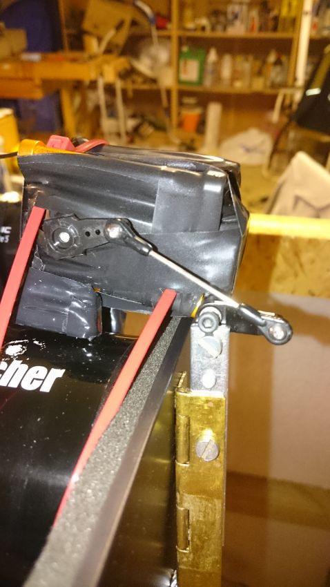
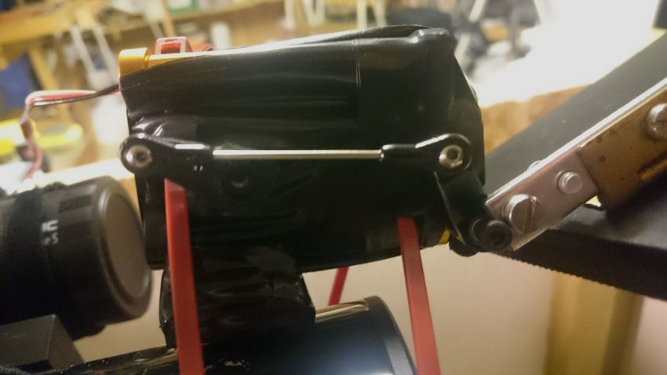
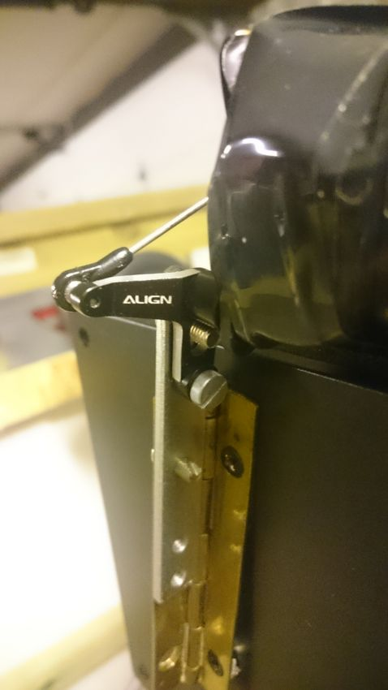
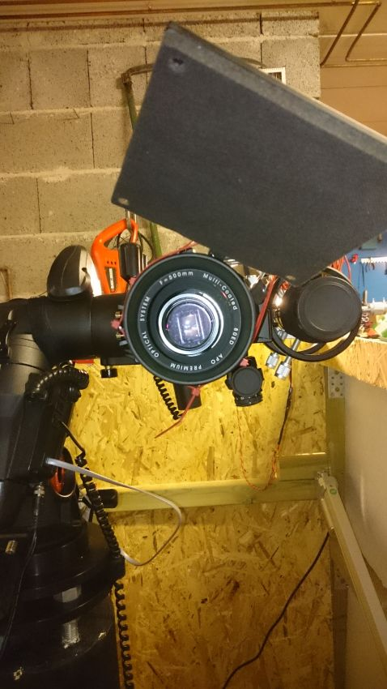
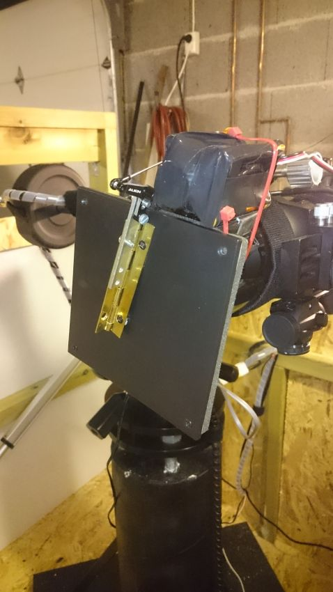

## Building a DIY dust cap for ServoBlaster Cap.
------------------------------------------------

### Summary
To summarize what we are going to go trough here, we are building a servo actuated, INDI and Ekos compatible dust cap. I will go trough the details as I show pictures of my fast tracked prototype. Some of the parts used for prototype is selected on convenience. Be creative and preferably use parts you already have lying around.

#### So what do we need to do that?
1. A bracket for the servo.
    * You should be able to mount the servo securely, in addition to a pivot that the dust cover attaches to.
    * You should be able to mount the bracket to some feet that attaches to the telescope.
    * The prototype's bracket was a aluminum bracket to mount a small motor to a RC-plane.
    * [An example of a bracket.](https://www.google.no/search?q=align+trex+600+metal+elevator+servo+mount&tbm=isch&tbo=u&source=univ&sa=X&ved=0ahUKEwjNvqbF8NLOAhWJfiwKHaX-DZIQsAQIJA&biw=1280&bih=932 "Example Bracket") (This would need modification to be able to attach the control arm.)
2. Two feet to mount the bracket on to the scope.
    * These feet should be 'tall / long' enough so that the bracket is mounted at the correct distance for the dust cover to cover the scope.
    * Use a lot of electrical tape or similar on the contact points to protect the scope from scratches.
    * Some sort of [U bracket](https://www.google.no/search?q=u+brackets&tbm=isch&tbo=u&source=univ&sa=X&ved=0ahUKEwie9La-gdPOAhVIDiwKHZO1D3sQsAQIHA&biw=1280&bih=932 "Example U bracket") can be used.
3. The Servo.
    * Preferably full-size or mid-size servo.
    * A long servo horn.
    * Servo used in the prototype is [Futaba s3050.](https://www.google.no/search?q=futaba+s3050&source=lnms&tbm=isch&sa=X&ved=0ahUKEwiDrsq7m9POAhWGlCwKHcoxCgAQ_AUICCgB&biw=1868&bih=988 "Example Servo")
4. The 90 degree control arm to flip the lid open and shut.
    * In the prototype a aluminum tail rotor control arm for an RC-helicopter was used, but similar type parts can work as well.
    * A link to connect servo to control arm.
    * [Example control arm](https://www.google.no/search?q=align+trex+600+tail+rotor+control+arm&source=lnms&tbm=isch&sa=X&ved=0ahUKEwiKhv6Y8NLOAhVCEiwKHVfNA8gQ_AUICCgB&biw=1280&bih=932 "Example Control Arm")
5. The dust cover.
    * Should be light weight.
    * Should have soft surface to close neatly on to scope, without leaving scratches.
    * Dust cover used in prototype is a dust cover / sound dampener from a Fractal design PC case.
    * A mounting solution to mount cover to control arm.

### A walk trough of the prototype.

#### Mounting to the scope.
This first picture is a view from the back where you can see the U shaped feet bracket and the box that holds the servo. As the servo and control arm is mounted on the side ot the box, the feet are mounted in an angle to keep the servo bracket straight, and off center relative to the dust cover.
Everything is held in place on the scope by zip ties. With the electrical tape on the feet, it will not slide up or down on the scope by accident.

#### Linking servo and control arm.
In the fully closed position you can see the servo is pushing the cover closed. On the prototype, the servo horn is slightly to short. If it was longer the link would be pushing on the servo with a steeper angle, making it have less slack. At the moment the cover is closed very gently against the scope, and I would like it to sit tighter. A longer servo horn will fix that.

In the fully opened position the cap clears the light-path of the scope, but with the short servo horn the cover is only opened to about ~105-110 degrees. With a longer servo horn it would open wider only limited by the geometry between the servo and the control arm.

#### Connecting the control arm to the dust cover.
Preferably you can use one solid peace. It must be a 90 degree angle to connect to the control arm, and to the cover. I had no small angled piece lying around, so I used a small hinge. After dunking it in quick dry super glue, it will stay at an 90 degree angle. It's also worth noticing that between the angle piece and the second screw connecting the piece to the cover, there are some spacers to help the cover close flat on the scope. When the longer servo horn is installed it might not be needed, but will not do any harm.

#### Calibrating the servo.
This is explained shortly in the [ServoBlaster Cap git repository.](https://github.com/magnue/indi_servoblaster_cap "ServoBlaster Cap git repository")
The calibration consists of three steps.
1. With the servo horn 'Preferably' unattached, Park and Unpark the cap. Check if the servo is moving in the correct direction relative to how it will be installed. If not, select "reverse direction" in the Calibrate Tab.
2. Park and Unpark the cap while increasing "travel", or Park the cap and use "step close" until the servo reaches limit, and repeat for Unpark. The "abs position (ms)" is the pulse-width of the current position and will be the limit. Update "Max travel Limits" for open and close in Calibrate Tab.
3. Install servo horn, and set "Preferred Limits" to ~80(%). Park and Unpark while increasing the percentage until the cap is firmly closed on the scope, and opens to a safe position.

* Remember to save config when done.
* Worth noting that the servo will move in "steps". There are no way of slowing down a servo other than to supply low voltage, so the total travel is calculated in to steps to slow it down. Not good to be slamming shut the dust cover! This does mean that the servo will catch up to the intended position before moving on, making the motion seam 'notchy'. This will not harm the servo.
* Hope you enjoy your low priced, automated dust cap :)

Cap Un-parked                                  |Cap Parked
:---------------------------------------------:|:---------------------------------------------:
|

#### A short youtube video of the cap unparking, and parking.

