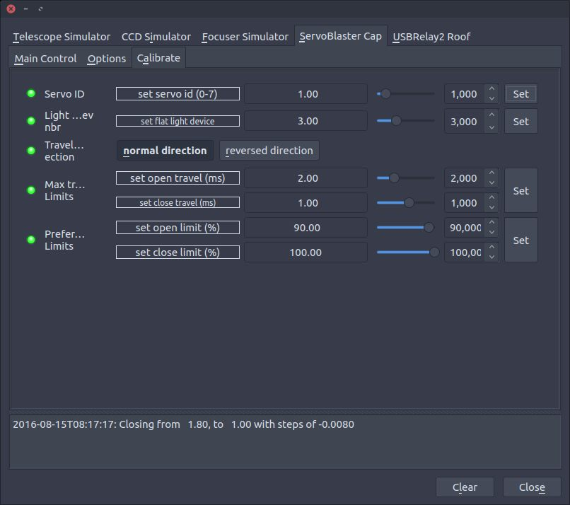
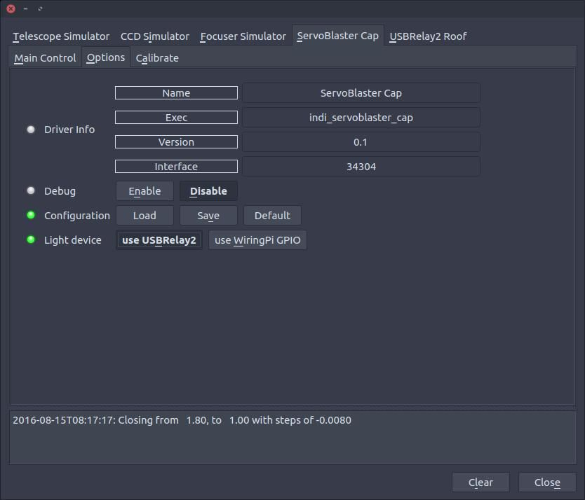
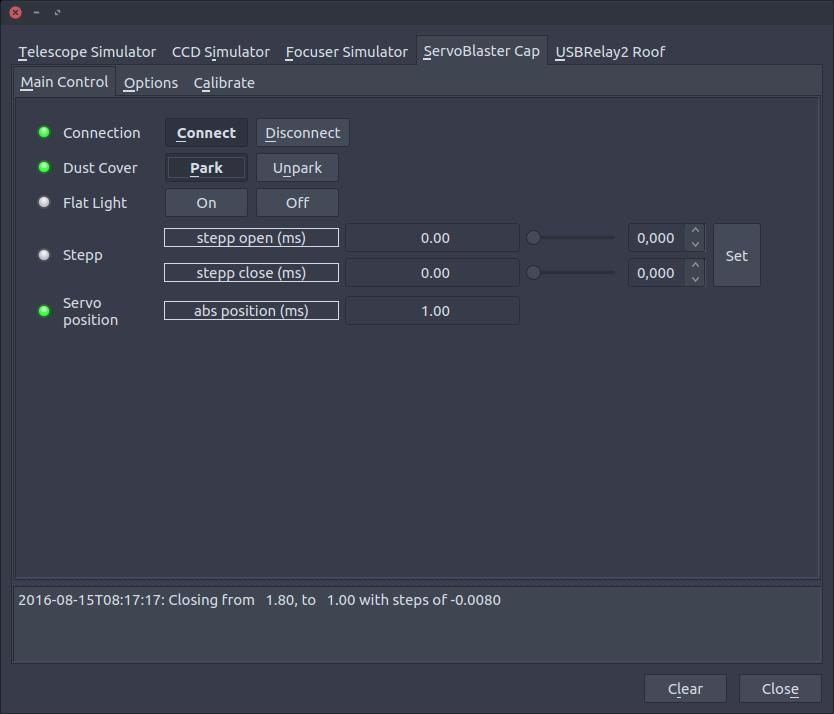

## INDI ServoBlaster Cap
------------------------

#### Deprecation notice
As I am not using a Rasberry Pi or a Odroid for my observatory any longer, I will not have a need for this driver, or the means to build and debug it. You can continue using this driver, at your own initiative, but I might not be able to help if you post an issue.

### Summary
INDI ServoBlaster Cap is a dust cap 'driver' compatible with INDI and EKOS, and built with the ServoBlaster interface.
ServoBlaster Cap does not have any hardware associated with it, other than it will work with a 'rc style' servo. The 'Cap' part must be built as a DIY project. Most servos is 4.8v and a old phone charger or similar would work as a powersupply. If you use a servo that is not 4.8v then change powersupply accordingly. The servo must use a PWM signal input in the range of '0.4 -> 1.3ms as 90 degree left', '1.5ms as centre', and '1.6 -> 2.6ms as right'. Most servos work at (0.5-1), 1.5, (2-2.5), but the range is set slightly higher to allow calibration to work with all servos.

Pin layout on Raspberry PI for ServoBlaster:

Servo number  | GPIO number   | Pin in P1 header |
 ------------ | :-----------: | -----------:     |
0             | 4             | P1-7             |
1             | 17            | P1-11            |
2             | 18            | P1-12            |
3             | 21/27         | P1-13            |
4             | 22            | P1-15            |
5             | 23            | P1-16            |
6             | 24            | P1-18            |
7             | 25            | P1-22            |

The Servo ID specified in Calibration, corresponds to the 'Servo number', connect servo to matching 'Pin in P1 header'

You can also (optionally) install USBRelay2 Roof, and use a power channel as a (fixed/undimmable) lightsource, or install WiringPi GPIO and use a gipo pin as a lightsource trigger.

### Building a device.
See also [HOWTO build a ServoBlaster Cap](BUILDING_DEVICE.md "HOWTO on building a device")

### Attributions
* This project could not be done without the existing INDIlib project or the ServoBlaster interface.
* This project is 3rd party and dependent on the mentioned projects, and licensed accordingly. See LICENSE and COPYING.BSD.
* Some files have additional lisence information, see file headers.

### Installing dependencies
1. **INDILib, and it's dependencies**
    * To build libindi from source [see instructions on indilib.org](http://www.indilib.org/forum/general/210-howto-building-latest-libindi-ekos.html "Link to build libindi")

2. **ServoBlaster**
    ```
    $ cd ~/Projects
    $ git clone https://github.com/richardghirst/PiBits.git
    $ cd PiBits/ServoBlaster/user/
    $ sudo make servod
    $ // Follow instructions on screen to add the init script and start servoblaster service (servod)
    ```

3. **(Optional) INDI USBRelay2 Roof, and it's dependencies**
    * To build USBRelay2 Roof from source [see instructions on github](http://github.com/magnue/indi_usbrelay2_roof "Link to build USBRelay2 Roof")

4. **(Optional) INDI WiringPi GPIO, and it's dependencies**
    * To build WiringPi GPIO from source [see instructions on github](http://github.com/magnue/indi_wiringpi_gpio "Link to build WiringPi GPIO")

### Install INDI ServoBlaster Cap
* **Install**
    ```
    $ cd ~/Projects
    $ git clone https://github.com/magnue/indi_servoblaster_cap.git
    $ cd indi_servoblaster_cap
    $ mkdir build
    $ cd build
    $ cmake -DCMAKE_INSTALL_PREFIX=/usr . ..
    $ sudo make install
    ```
* **Update**
    ```
    $ cd ~/Projects/indi_servoblaster_cap/
    $ git pull
    $ cd build
    $ sudo make install
    ```

### Screenshots

#### Calibrate
* Configure Servo ID, Flat Light device, calibrate travel limits, prefered limits, and optionally reverse servo direction.
* To configure a USBRelay2 channel for light source, make sure atleast one Power device is added to the "Device Setup Tab" of USBRelay2 Roof. Take a note of the "dev x" number. In ServoBlaster Cap's "Calibrate tab", set "Flat light device" to "x", and make sure Light Device is set to "use USBRelay2" in ServoBlaster's "Options Tab".
* To configure WiringPi GPIO pin for light source, make sure WiringPi GPIO has atlest one pin defined as output. Take a note of the "Pin: x" number on WiringPi GPIO's "Main Control Tab", and set "Flat light device" to "x". Make sure "use WiringPi GPIO" is set in ServoBlaster's "options Tab".




#### Main Control
* Not much to it. Parked = closed, UnParked = open - ready to image.
* Parking Cap will turn off lightsource, and lightsource can only be operated when Cap is unparked.
* To find Max travel limits, park cap then use 'step close' until cap is fully closed on the scope. The abs position will be the close limit in Calibrate Tab.
* Repeat for open. The open and close limits should be the full possible travel for the cap.
* If you want the cap only to open to 10% of the open limit, set Prefered limit open to 10%. Note that open limit is travel from centre position to fully opened.


